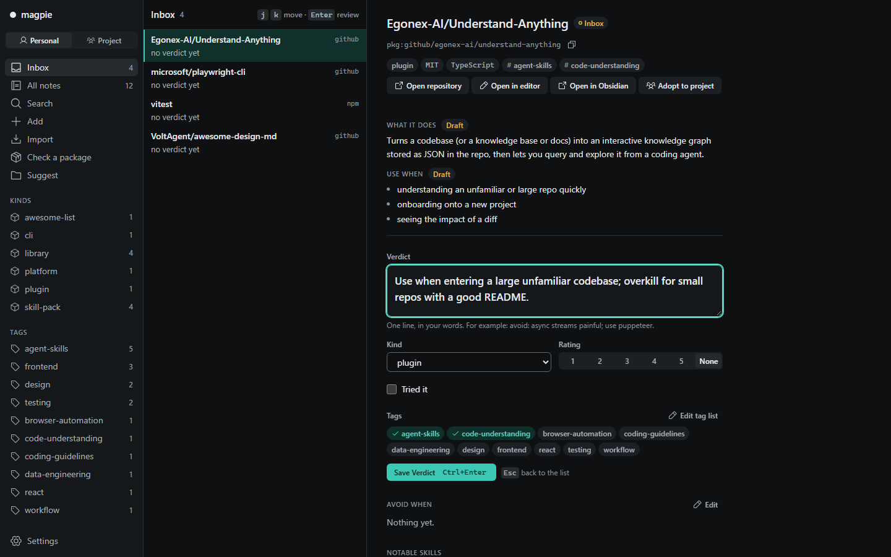
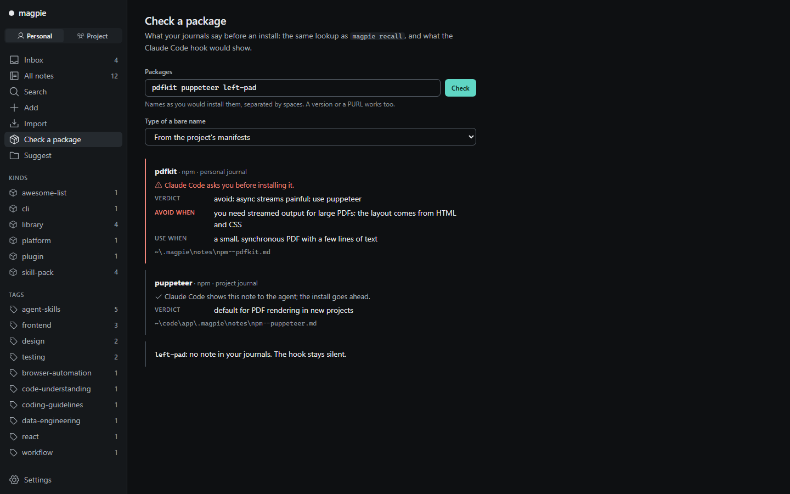
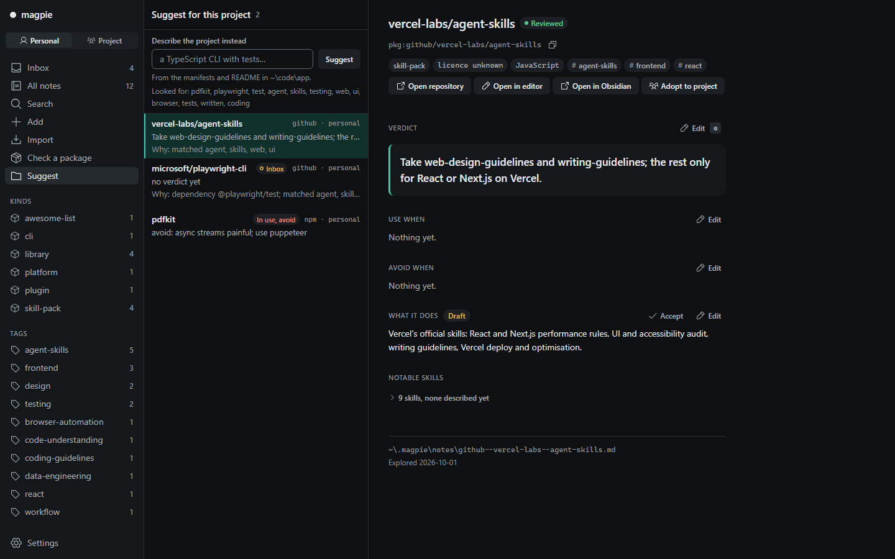

<p></p>

# RepoMagpie

> RepoMagpie remembers what you and your team learned about every dependency, and tells your coding agent before it installs one.

- **Remember:** write a verdict in one line, `magpie note pdfkit "avoid: async streams painful; use puppeteer"`. Notes are Markdown files you own.
- **Recall before install:** when your agent runs `npm install pdfkit`, it sees your note first. A note that says to avoid the package makes Claude Code ask you.
- **Suggest:** `magpie suggest` reads a project's manifests and README, and lists the notes that fit it.

**Status:** pre-release `0.1.0-beta.1`, for early testers. See the [changelog](CHANGELOG.md) and the [roadmap](docs/roadmap.md).

## Quick start

You need Node.js 22.12 or later.

1. Install the `magpie` command:

   ```bash
   npm install -g repomagpie@beta
   ```

2. Write your first note. Give a package name, or a GitHub URL to also fetch the repository's licence, topics and agent skills:

   ```bash
   magpie note pdfkit "avoid: async streams painful; use puppeteer"
   magpie note https://github.com/microsoft/playwright-cli "use for agent browser tests"
   ```

   Notes go to your personal journal in `~/.magpie`. Add `--to project` to write to the project journal, `.magpie/` in the repository, which your team shares through git.

3. Add the hook to `~/.claude/settings.json`, or to a project's `.claude/settings.json`, so Claude Code checks your notes before every install:

   ```json
   {
     "hooks": {
       "PreToolUse": [
         { "matcher": "Bash|PowerShell",
           "hooks": [ { "type": "command", "command": "magpie hook claude-code" } ] }
       ]
     }
   }
   ```

   The hook never blocks an install. When nothing matches, or anything fails, it stays silent. For unattended `claude -p` runs, use `magpie hook claude-code --inform-only`, so notes inform the agent and never ask.

4. Open your journals in the browser to review inbox notes, search and edit:

   ```bash
   magpie ui
   ```

5. Install the agent skill, for Claude Code and any other agent that supports [Agent Skills](https://agentskills.io):

   ```bash
   npx skills add Varshavia/RepoMagpie
   ```

   With the skill, the agent runs `magpie recall` before it adds a dependency, answers "what do I have for browser testing?" with `magpie search`, and offers to save your opinion on a tool. In agents without the hook, the skill is the only recall check, and it works as well as the agent follows it.

More commands: `magpie search`, `magpie recall`, `magpie adopt` and `magpie import`. Run `magpie --help`, or read the [spec](docs/spec.md).

## The local app

Review an inbox note: write the Verdict, set kind, tags and rating, and press Ctrl+Enter.



Check a package: what your journals say before an install, and what the Claude Code hook would do.



Suggest for this project: the notes that fit, and why each one is a candidate.



## How it compares

| Tool | What it knows | When you see it |
|---|---|---|
| Star managers, such as [Starcat](https://github.com/starcat-app/Starcat) and [GithubStarsManager](https://github.com/AmintaCCCP/GithubStarsManager) | The repositories you starred, with tags and notes | When you search them later |
| Supply-chain scanners, such as [Socket Firewall Free](https://github.com/SocketDev/sfw-free) | Malware, vulnerabilities and popularity, from global data | Before an install |
| RepoMagpie | Your verdicts and your team's | Before an install, when you search, and when you start a project |

RepoMagpie doesn't replace a scanner: it never claims to detect malware, and it never installs anything. Run a scanner such as Socket Firewall Free next to it.

A line like "avoid pdfkit" in `CLAUDE.md` covers one project. A RepoMagpie note works across projects, shows up in search, and the hook checks it on every install.

## Privacy

magpie never sends your notes anywhere. The personal journal is a folder of Markdown files on your machine, and a project journal is as visible as its repository. `magpie ui` listens on `127.0.0.1` only.

The only network requests are to GitHub's API, when you give `magpie note`, `magpie import` or the app's Add page a GitHub repository: they read its metadata, file list and root manifests. They send `GITHUB_TOKEN` if you set it, and nothing from your journals. Without a token, GitHub allows 60 requests an hour. There is no telemetry.

## Platforms

- Node.js 22.12 or later. CI runs on Linux and Windows, with Node 22, 24 and 26. macOS isn't tested yet.
- The hook works in Claude Code. Other agents use the skill.
- The package has no runtime dependencies.

## Documentation

- [Spec](docs/spec.md): every command, flag and `--json` document
- [Note schema](docs/note-schema.md): the format of a note
- [The local app](docs/ui.md): screens, API and security rules
- [Roadmap](docs/roadmap.md) and [changelog](CHANGELOG.md)
- [Vision](docs/vision.md), [competitors](docs/competitors.md) and [decisions](docs/decisions/)

Open an issue for bugs and ideas. The project doesn't take pull requests yet ([CONTRIBUTING.md](CONTRIBUTING.md)). To report a vulnerability, see [SECURITY.md](SECURITY.md).

## Licence

[MIT](LICENSE) © 2026 Yusuf Suat Babacan
